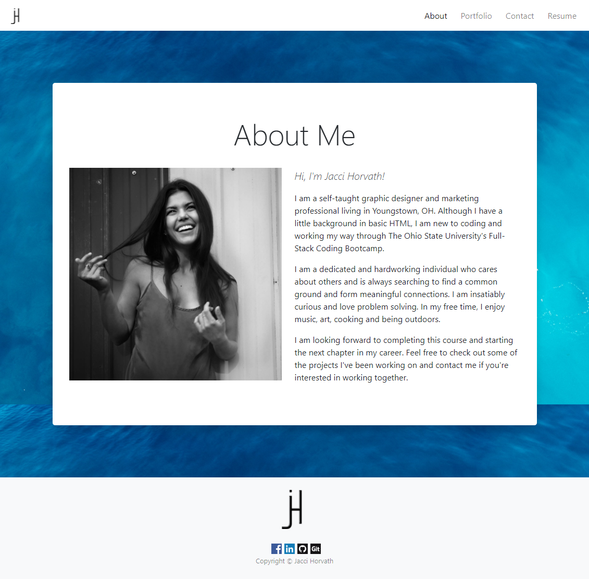
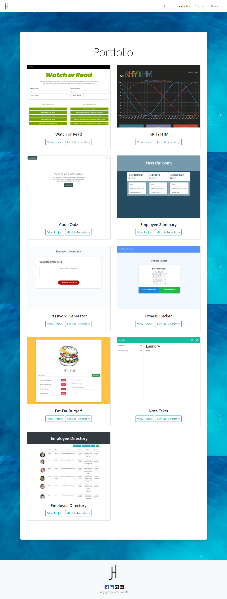
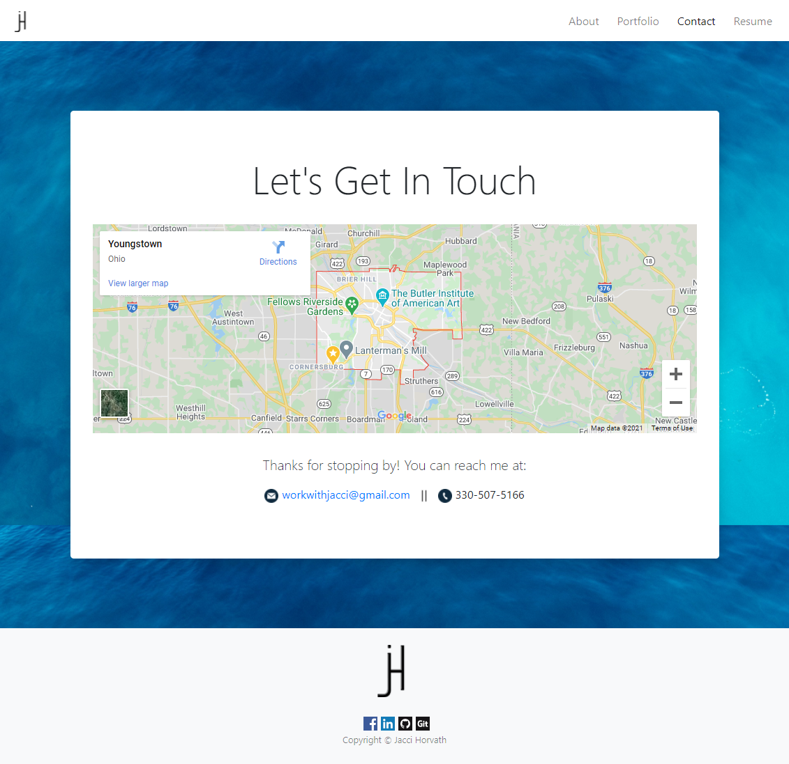
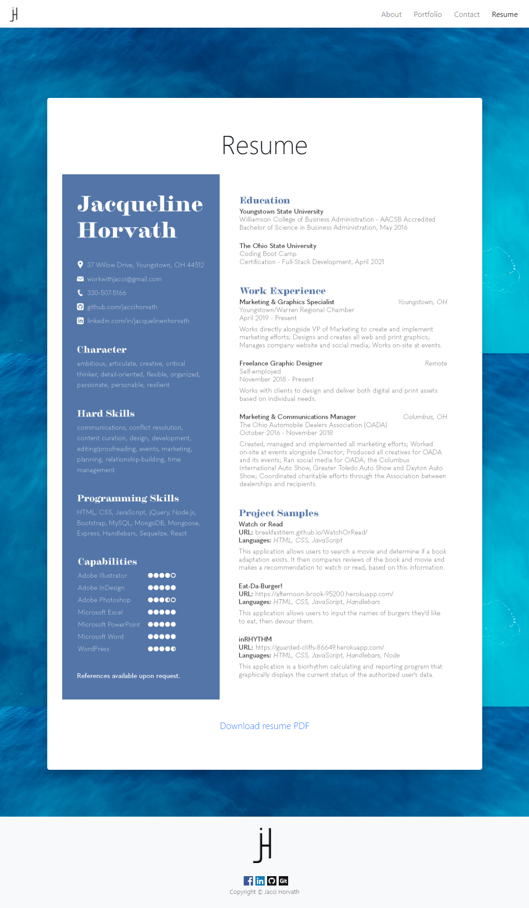

# React Portfolio

## Description
In this repository, you will find a responsive portfolio created with React and comprised of the following four pages:
* About Me 
* Portfolio 
* Contact 
* Resume

Each of the pages feature:
* A responsive layout
* A background image
* A fixed-top navbar that includes my personal logo and links to the other pages
* A sticky footer that includes my personal logo, links to my social media accounts (that open in a new window) and copyright Jacci Horvath

### About Me
The About Me page is comprised of a headshot and a short paragraph about myself.

### Portfolio
The Portfolio page is comprised of image cards with nine completed projects. Each image card contains the title of the project, a link to the deployed application and a link to the GitHub repository that houses the code.

### Contact
The Contact page is comprised of an embedded map showing my location, as well as my phone number and email address.

## Mock-Up
The finished project can be deployed [here](https://jaccihorvath.github.io/react-portfolio3.0/#/).

### Screenshots

## Contributing
* [ReactJS](https://reactjs.org/)
* Javascript
* [Bootstrap](https://getbootstrap.com/)

## Contact Information
Find [jaccihorvath on GitHub](https://github.com/jaccihorvath) or email [jacci@gmail.com](mailto:jacci@gmail.com) with additional questions.

## License
Copyright (c) [jaccihorvath](https://github.com/jaccihorvath).
Licensed under the MIT License.
